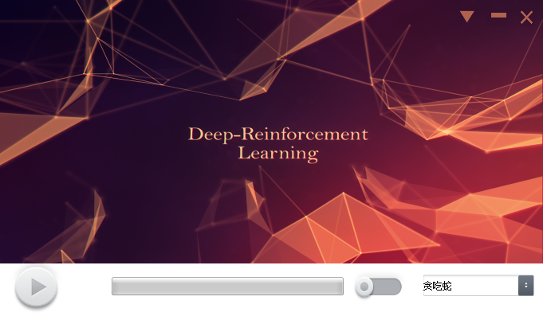
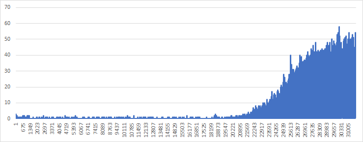

#强化学习工具箱(DRLToolbox)

##概述
该项目建立了一个集成强化学习训练、训练结果可视化、调参等功能于一体的工具箱，使用小游戏对
算法进行测试学习。该工具箱可以帮助人们在同一个窗口内检测训练情况和调参。

##配置情况
*Python 3
*TensorFlow-gpu
*pygame
*OpenCV-Python

##如何运行？
运行run_window.py可启动窗口
+ 启动界面


+ 主界面



+ 设置界面

  


###其他功能详见项目大报告

##什么是强化学习？
详见报告

##最终表现
以贪吃蛇为例，经过超过500万次训练（超过48小时），一共完成36171局，每局分数如下图：



截取一个片段如下：


##Deep Q-Network Algorithm
```python
Initialize replay memory D to size N
Initialize action-value function Q with random weights
for episode = 1, M do
    Initialize state s_1
    for t = 1, T do
        With probability ϵ select random action a_t
        otherwise select a_t=max_a  Q(s_t,a; θ_i)
        Execute action a_t in emulator and observe r_t and s_(t+1)
        Store transition (s_t,a_t,r_t,s_(t+1)) in D
        Sample a minibatch of transitions (s_j,a_j,r_j,s_(j+1)) from D
        Set y_j:=
            r_j for terminal s_(j+1)
            r_j+γ*max_(a^' )  Q(s_(j+1),a'; θ_i) for non-terminal s_(j+1)
        Perform a gradient step on (y_j-Q(s_j,a_j; θ_i))^2 with respect to θ
    end for
end for
```

##开发者
**中山大学 岭南学院**      梁智鹏  陈昊  张意伟
同时感谢**中山大学 数学学院**    付星宇 的理论指导

##参考文献
[1] Mnih Volodymyr, Koray Kavukcuoglu, David Silver, Andrei A. Rusu, Joel Veness, Marc G. Bellemare, Alex Graves, Martin Riedmiller, Andreas K. Fidjeland, Georg Ostrovski, Stig Petersen, Charles Beattie, Amir Sadik, Ioannis Antonoglou, Helen King, Dharshan Kumaran, Daan Wierstra, Shane Legg, and Demis Hassabis. **Human-level Control through Deep Reinforcement Learning**. Nature, 529-33, 2015.

[2] Volodymyr Mnih, Koray Kavukcuoglu, David Silver, Alex Graves, Ioannis Antonoglou, Daan Wierstra, and Martin Riedmiller. **Playing Atari with Deep Reinforcement Learning**. NIPS, Deep Learning workshop

[3] Kevin Chen. **Deep Reinforcement Learning for Flappy Bird** [Report](http://cs229.stanford.edu/proj2015/362_report.pdf) | [Youtube result](https://youtu.be/9WKBzTUsPKc)

[4] Flood Sung. **Deep Reinforcement Learning 基础知识（DQN方面）**https://blog.csdn.net/songrotek/article/details/50580904

[5]Giannoccarro Ilaria and Peperpaolo Pontrandolfo. **Inventory management in supply chains: a reinforcement learning approach**, *International Journal of Production economics*, 2002, 153-161

[6] Zhengyao Jiang, Dixing Xu and Jinjun Liang. **A Deep Reinforcement Learning Framework for the Financial Portfolio Management Problem**,https://arxiv.org/abs/1706.10059